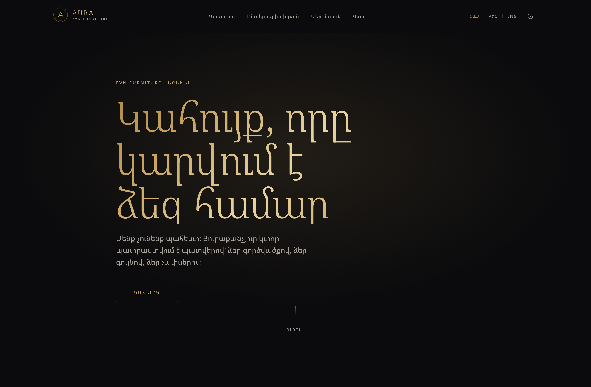
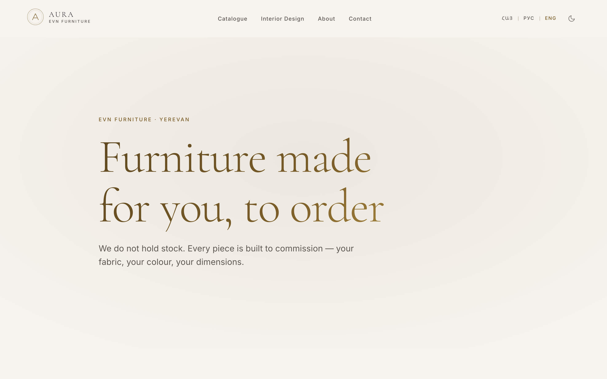
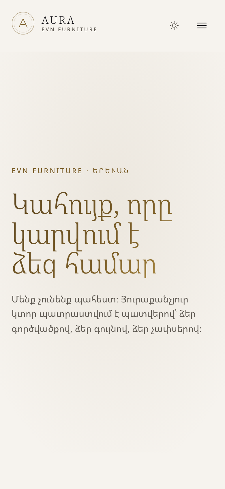
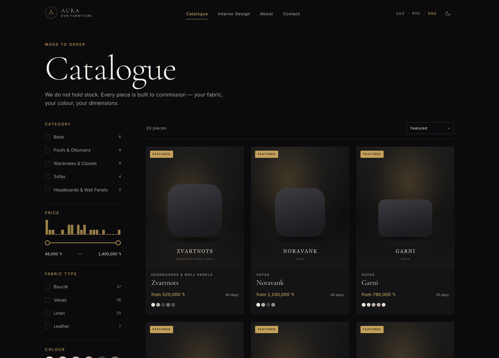
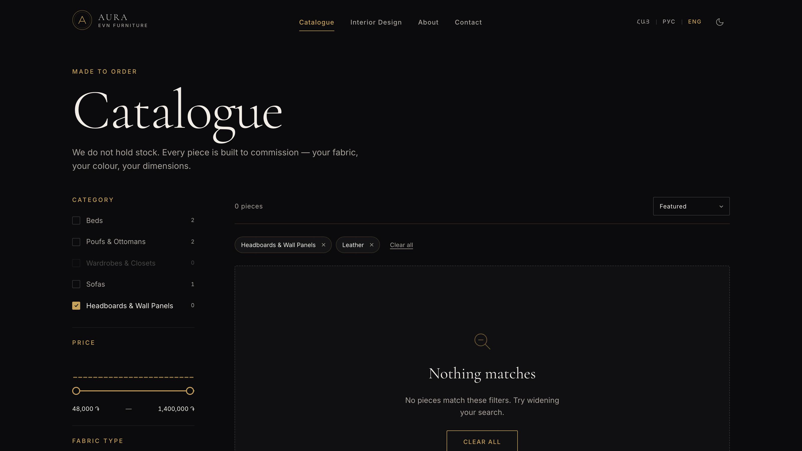
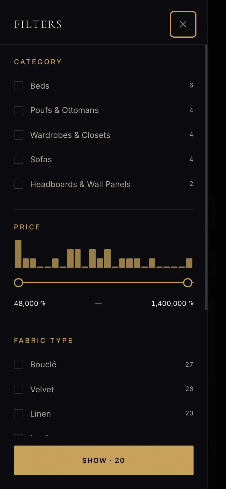

# Aura Interior

Production website for **Aura Interior** (`@aura_Interior` / EVN FURNITURE), a Yerevan
furniture manufacturer that builds every piece to order.

> **There is no cart and no checkout.** Aura manufactures to commission — customers
> pick a piece, then specify fabric, colour and dimensions. The primary conversion
> action across the whole site is **"Request this piece"**, an enquiry that captures
> the product, the customer's fabric and size preferences, and their contact details.
> Prices are `from N ֏` starting points, never fixed SKU prices.

<p align="center">
  
</p>
<p align="center">
  
  
</p>
<p align="center">
  
</p>
<p align="center">
  
  
</p>

---

## Quick start

Requires **Node ≥ 20.19** (developed on 24.20.0 LTS).

```bash
cp .env.example .env      # then edit ADMIN_PASSWORD and JWT_SECRET
npm run setup             # install → prisma generate → db push → images → seed
npm run dev               # api on :4000, web on :5173
```

Open <http://localhost:5173> — it redirects to `/hy`, the default locale.

`npm run setup` is idempotent; re-run it any time. To wipe and reseed only the
database, use `npm run db:reset`.

---

## Scripts

| Command                                                  | What it does                                                   |
| -------------------------------------------------------- | -------------------------------------------------------------- |
| `npm run dev`                                            | Both apps, concurrently. Builds `@aura/types` first.           |
| `npm run build`                                          | Types → API → web, in dependency order.                        |
| `npm run typecheck`                                      | Every workspace plus the seed and root scripts.                |
| `npm run lint` / `lint:fix`                              | ESLint 10 flat config across the monorepo.                     |
| `npm run format`                                         | Prettier over `ts,tsx,scss,json,md`.                           |
| `npm run check:contrast`                                 | **Enforces the gold-palette contrast rule.** See below.        |
| `npm run media:generate`                                 | Regenerates all responsive image variants + blur placeholders. |
| `npm run db:push` / `db:seed` / `db:reset` / `db:studio` | Prisma.                                                        |

---

## Architecture

```
aura-interior/
├── apps/
│   ├── api/                 Express 5 + Prisma 7 (SQLite via driver adapter)
│   │   ├── prisma/
│   │   │   ├── schema.prisma
│   │   │   ├── data/        the seed catalogue — single source of truth
│   │   │   └── seed.ts
│   │   └── src/
│   │       ├── routes/      one router per resource
│   │       ├── lib/         serializers, query parsing, typed errors
│   │       └── middleware/
│   └── web/                 React 18 + Vite 7 + SCSS modules
│       └── src/
│           ├── styles/      _tokens · _mixins · _reset · global
│           ├── i18n/        trilingual dictionaries + provider
│           ├── components/  one folder per component
│           ├── routes/
│           ├── services/    the ONLY place that talks to the network
│           └── hooks/
├── packages/types/          shared contracts, imported by both apps
└── scripts/                 image pipeline, contrast audit
```

**Shared types.** `@aura/types` holds every contract (`Product`, `Inquiry`,
`Localized`, …) and is imported by both apps — never duplicated. It compiles to
real JS because it also exports runtime values (`LOCALES`, `localize`).

**Service boundary.** Components never call `fetch`. ESLint enforces this: `fetch`
is a restricted global everywhere except `src/services/`.

---

## Three languages, from day one

Armenian is the **default** — the business is in Yerevan and its Instagram bio is
already trilingual. Every route carries a locale prefix: `/hy`, `/ru`, `/en`.

This was wired in Phase 1 rather than retrofitted later, because adding locale
prefixes to a finished router means rewriting every link, route and canonical URL.

- Copy lives in `apps/web/src/i18n/locales/`. `hy.ts` is the **source of truth for
  the dictionary shape** — `ru.ts` and `en.ts` are typed against it, so a missing
  key is a compile error, not a blank string in production.
- Database copy is stored as three sibling columns (`nameHy`/`nameRu`/`nameEn`)
  rather than a JSON blob, so each language stays independently indexable and
  sortable. The API packs them into a `Localized` object at the edge.
- Product model names (Arev, Sevan, Ararat…) are Armenian proper nouns and are
  identical across locales — only descriptive copy changes length.
- Armenian and Russian strings run longer than English. Card copy uses the
  `line-clamp` mixin, and headings ease off Cormorant's negative tracking under
  `:lang(hy)`.

**Fonts:** Cormorant Garamond and Inter cover Latin and Cyrillic but have **no
Armenian glyphs**. Left alone, the default locale silently loses the brand's serif
identity to an arbitrary system fallback. `:lang(hy)` therefore puts _Noto Serif
Armenian_ and _Noto Sans Armenian_ first.

---

## API

```
GET    /api/products              filters, sort, pagination → { items, total, facets }
GET    /api/products/:slug        product + images + fabrics + approved reviews
GET    /api/categories
GET    /api/fabrics
GET    /api/projects              interior design portfolio
GET    /api/reviews?productId=    approved only
GET    /api/reviews/summary/:id   average + per-star breakdown
POST   /api/reviews               → PENDING, rate-limited
POST   /api/inquiries             the conversion endpoint
GET    /api/search?q=             trilingual, across names, copy and materials
POST   /api/admin/login           JWT
GET    /api/admin/me
CRUD   /api/admin/products        protected
POST   /api/admin/products/:id/images     multer → sharp
DELETE /api/admin/products/:id/images/:imageId
GET    /api/admin/reviews         moderation queue
PATCH  /api/admin/reviews/:id     approve / reject
GET    /api/admin/inquiries       inbox
PATCH  /api/admin/inquiries/:id   status
GET    /api/admin/stats           dashboard counts
```

Every body is parsed by Zod before a route sees it, and failures come back as
per-field messages so forms can render errors inline rather than as one toast:

```json
{
  "error": {
    "code": "BAD_REQUEST",
    "message": "Please check the highlighted fields",
    "fields": { "phone": "Phone number is too short" }
  }
}
```

**Enquiries are the conversion path**, so the row is committed _before_ the
email is attempted and the notification is fired without awaiting it — an SMTP
outage must never cost a lead. With no `SMTP_HOST` configured the transport logs
the full message to the console instead: a local developer still sees exactly
what would have been sent, and a misconfigured deploy is loud rather than
silently dropping leads.

**Reviews are never published unmoderated.** `POST` always writes `PENDING` and
answers `202`; only `PATCH /api/admin/reviews/:id` can approve. `authorEmail` is
returned to admins only.

**Rate limits** are per-route because the reason differs: inquiries 5/15min
(protect the inbox), reviews 3/hour (protect moderation), login 10/15min
counting _failures only_ so an admin is never locked out by their own successes,
uploads 30/min. Both public POSTs also carry a honeypot field — deliberately
_not_ validated to `max(0)`, since a field error naming `website` would teach a
bot which input to leave alone. The route answers `201` and stores nothing.

**Login does not leak which half was wrong.** A missing user is compared against
a dummy hash so the response time matches, and both failure modes return the
same message.

**Uploads** run the same pipeline as the placeholder generator — AVIF + WebP +
JPEG at 400/800/1600 plus a blur placeholder — and produce the same filenames,
so an uploaded photo and a generated placeholder are indistinguishable to
`ResponsiveImage`. Derivatives are served from `/uploads` with a one-year
immutable cache, since every filename is UUID-addressed.

## Catalogue filtering

Every filter lives in the query string, so results are shareable and browser
back/forward works with no second copy of the state to fall out of sync:

```
/en/catalogue?categories=beds&fabricCategories=LEATHER&priceMin=600000&sort=price-asc
```

Those param names are the API's own contract — a URL a customer pastes into a
chat is also a URL you can `curl`.

**Facets are contextual.** Each dimension is counted with every _other_ active
filter applied but not its own. With "Beds" ticked, the fabric counts narrow to
what beds actually come in, while the category counts still show what ticking
Sofas as well would add. Options that would return nothing are disabled rather
than hidden, so the shape of the catalogue stays readable — except an option you
have already selected, which always stays clickable so you can switch it back off.

**The price slider** is two overlapping native `<input type="range">` elements
rather than pointer handlers on divs, which buys real keyboard support, correct
touch behaviour and screen-reader announcements. Its track uses whole-catalogue
bounds so it never moves under your finger, while the histogram above it redraws
against the current filters. It is the only control that fires continuously, so
it alone is debounced (250ms) and writes history with `replace` — dragging a
slider should not stack forty back-button entries. Discrete filters commit
immediately; a quarter-second lag on a checkbox just feels broken.

**Results cross-fade, never blank-flash.** TanStack Query's `keepPreviousData`
holds the previous page mounted while the next is in flight; the grid dims rather
than collapsing, so nothing below it jumps.

**The count ticks** from its old value to its new one, and re-derives its label
every frame — Russian changes the noun as the number passes 1 and 5
(предмет / предмета / предметов), so it goes through `Intl.PluralRules` rather
than an `n === 1` check.

## Motion

The portfolio layer. Everything below is gated on **one** `useReducedMotion()`
hook, and most of it is expressed in CSS so the reduced-motion variant is
enforced by the cascade rather than by each caller remembering to check.

- **Scroll reveals** — `useReveal()` over IntersectionObserver, rise 24px + fade,
  60ms sibling stagger, fires once. One shared observer per
  (threshold, rootMargin) pair, not one per element: a catalogue page mounts 40+
  revealing nodes and 40 observers all fight over the same scroll.
- **Text reveals** — headlines are split by **rendered line**, not by word.
  There is no way to know where a line breaks without laying the text out, so
  `SplitText` renders once with each word wrapped, reads their `offsetTop` to
  group them into lines, then re-renders those lines inside `overflow: hidden`
  masks sliding up from `translateY(100%)`, 80ms apart. It re-measures on locale
  change, on resize, and after webfonts load — Cormorant and the Noto Armenian
  faces all move the breaks.
- **Gold shimmer** — one sweep of `--gold-metal` across the hero headline and the
  logo on entry, via `background-position` on `background-clip: text`. Once, never
  looping: a looping shimmer on a headline reads as a broken loading state.
- **Smooth scroll** — Lenis at lerp 0.09. Overlays that lock the page
  (nav sheet, filter drawer) pause it through a reference-counted handle;
  `overflow: hidden` stops native scrolling but not Lenis.
- **Magnetic CTAs** — 8px pull toward the cursor, spring back on leave, gated
  behind `(pointer: fine)` so a touch tap never triggers it.
- **Custom cursor** — desktop only, a gold dot that grows and reads "View" over
  product cards. `pointer-events: none`, always.
- **Studio lamp** — a radial highlight behind the hero that drifts with the
  cursor at heavy damping. At 1:1 tracking it reads as a torch, not lighting.
- **Image loading** — blur placeholder cross-fading to the sharp image, with the
  aspect ratio reserved up front so nothing reflows.

### Under `prefers-reduced-motion: reduce`

Verified in Chrome with the media feature emulated, not assumed:

|                               | normal               | reduce             |
| ----------------------------- | -------------------- | ------------------ |
| transition properties         | `opacity, transform` | `opacity`          |
| stagger delays                | 0s / 0.18s / 0.3s    | all `0s`           |
| non-identity transforms       | present              | **0**              |
| headline split into lines     | 2                    | **0** (plain text) |
| shimmer animation             | runs once            | `none`             |
| custom cursor in DOM          | yes                  | **no**             |
| Lenis                         | active               | **not mounted**    |
| grain + scroll-cue animations | running              | `none`             |

Smooth scrolling is itself motion, so Lenis never mounts under `reduce` — the
page falls back to native scrolling, which is the correct behaviour.

## The contrast rule

The one trap in a gold palette:

| Pair                           | Ratio      |                                |
| ------------------------------ | ---------- | ------------------------------ |
| `--gold` on `--obsidian`       | **8.10:1** | safe for text at any size      |
| `--gold` on `--porcelain`      | **2.19:1** | **fails** — never use for text |
| `--gold-deep` on `--porcelain` | **5.54:1** | the light-mode replacement     |

Light mode remaps `--accent-text` to `--gold-deep` automatically, so components
never need to know which theme is active. This is verified, not assumed:

```bash
npm run check:contrast    # 12 pairs, reads the real hex values out of _tokens.scss
```

The audit asserts that gold-on-light **fails** — if a token change ever made it
pass, the remap would be dead code and the check says so.

**Gradients are checked stop by stop.** A metallic sweep paints text with every
stop as it animates, so each one has to clear the bar on its own. `--gold-metal`
ends on `#7A5D28`, which is 3.21:1 on obsidian: fine for the 48px+ headline
(AA-large is 3:1), a failure at 18px. Small gold text therefore uses
`--gold-metal-text`, a constrained ramp whose every stop clears 4.5:1 in both
themes — so the shimmer can never sweep through unreadable text. Both ramps are
in the audit.

---

## Design system

Dark is the default for everyone; light is an explicit toggle, never
`prefers-color-scheme`. Components reference only semantic tokens (`--bg`,
`--text`, `--accent-text`), so the theme swap is one attribute on `<html>`.

- **Space:** 4px scale — 4 8 12 16 24 32 48 64 96 128 192.
- **Type:** Cormorant Garamond (display) + Inter (body), fluid `clamp()` throughout.
- **Motion:** `--ease-out: cubic-bezier(0.16, 1, 0.3, 1)`, 200ms micro / 400ms
  standard / 700ms hero.
- **Texture:** SVG `feTurbulence` grain at ~3%, radial studio vignettes, 1px gold
  hairline rules. Gold is used sparingly — if everything is gold, nothing is.

`_mixins.scss` is auto-injected into every `.module.scss` by Vite, so components
get `mq()`, `fluid-type()`, `container()`, `focus-ring()`, `grain-overlay()` and
friends without an import line. `_tokens.scss` is deliberately **not** injected —
it emits custom properties and must be pulled in exactly once, by `global.scss`.

---

## Images

`npm run media:generate` runs the real production pipeline: **sharp → AVIF + WebP +
JPEG at 400/800/1600px, plus a base64 blur placeholder**, writing a manifest the
seed reads.

The current images are **generated placeholders**, not photography — branded dark
studio renders at the correct aspect ratios. They are deliberately built through
the same pipeline real photos will use, so nothing about the layout depends on
them being fake.

**To drop in real photography:** put files in `media/source/` named after their
manifest key (e.g. `product-arev-bed-1.jpg`) and re-run `npm run media:generate`.
The script prefers a real source file over a generated one whenever it finds one.
No application code changes.

---

## Database

SQLite for local development, written to stay **Postgres-portable**:

- No Prisma `enum`s (SQLite has none) — status columns are `String`, validated by
  Zod at the edge and typed as unions in `@aura/types`.
- No `Json` columns, no array columns — every to-many relation is a join table.
- Money is `Int` (Armenian dram has no minor unit), never `Float`.

Prisma 7 keeps the connection URL in `prisma.config.ts`, not the schema, and the
runtime client connects through a **driver adapter**. `src/db.ts` is the only file
that knows the database is SQLite — moving to Postgres means swapping
`@prisma/adapter-better-sqlite3` for `@prisma/adapter-pg` and changing one
provider line.

---

## Status

| Phase |                                                                                                |                                                             |
| ----- | ---------------------------------------------------------------------------------------------- | ----------------------------------------------------------- |
| 1     | Foundation — monorepo, SCSS system, Prisma schema, 20-product seed, layout shell, i18n routing | **done**                                                    |
| 2     | Backend API — full REST surface, auth, uploads, rate limiting, mail                            | **done**                                                    |
| 3     | Catalogue & filtering                                                                          | **done**                                                    |
| 4     | Pages — home, product detail, interior design, about, contact, admin                           | pending — hero done, rest of Home + other pages outstanding |
| 5     | Motion — reveals, text masks, gold shimmer, Lenis, magnetic buttons, cursor                    | **done**                                                    |
| 6     | Business & polish — SEO, wishlist, analytics, a11y, performance                                | i18n done ahead of schedule                                 |

Routes not yet built render an honest placeholder naming the phase that builds
them, so nothing here can be mistaken for finished work.

### Already live from later phases

Some Phase 5/6 foundations were laid early because retrofitting them is expensive:

- **Reduced motion** — every animated surface reads one `useReducedMotion()` hook,
  so the guarantee is checkable rather than aspirational.
- **Page transitions** — dark-safe fade + lift, no white flash.
- **Accessibility** — skip link, focus-visible rings, `aria-*` on the mobile sheet
  with Escape-to-close, scroll lock and focus restoration.

---

## Environment

Everything is configured through the repo-root `.env`; `.env.example` documents
every key. Real credentials are never committed and the seeded admin comes from
`ADMIN_EMAIL` / `ADMIN_PASSWORD` — the seed warns loudly if the placeholder
password is still in place.
